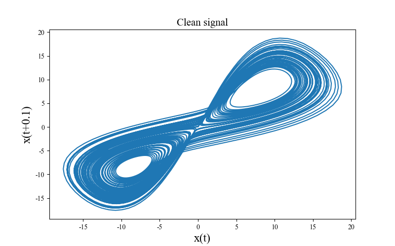
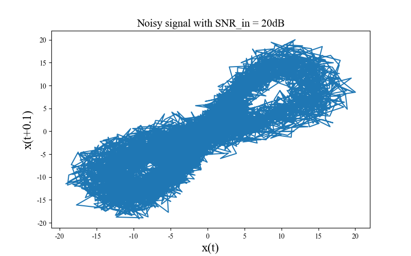
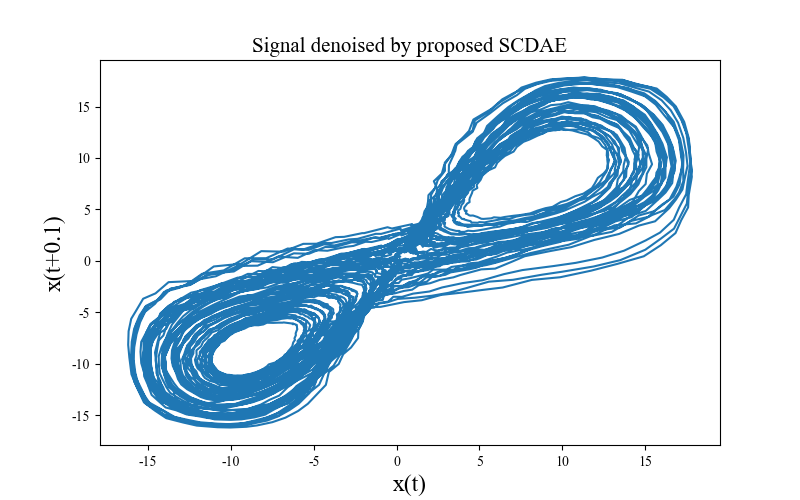
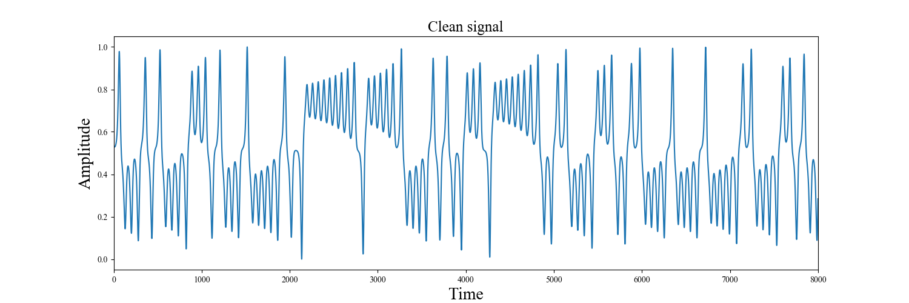
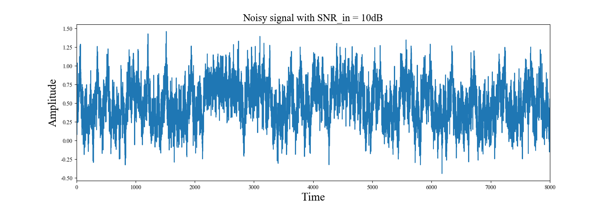
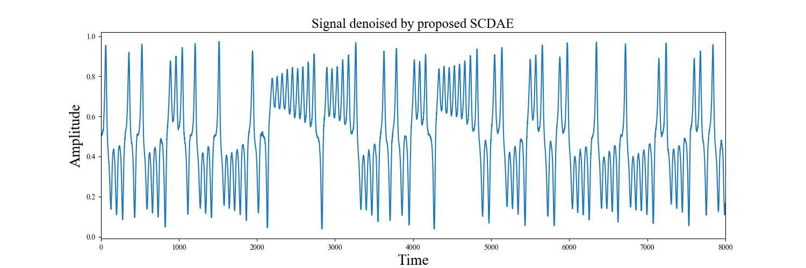

## File Description
* **Lorenz_data**: In this work, we use the **Lorenz_data.mat** and **Lorenz_validation_data.mat** dataset in this folder for model training and validation, and use the **Lorenz_test_data.mat** dataset as the test data.
* **data_generation.py**: Read the dataset in the **Lorenz_data** folder, normalize the data and add noise to it.
* **model.py**: The model used by SCDAE.
* **hparams.py**: Hyperparameters for the model.
* **eval.py**: Evaluate the model training results and plot the phase-space portraits of the Lorenz attractor and 1D comparison chart.

## Copyright
If you use our codes in your research, please acknowledge our work by citing the following paper:  
Chaotic Signal Denoising Based on Convolutional Denoising Auto-Encoder
